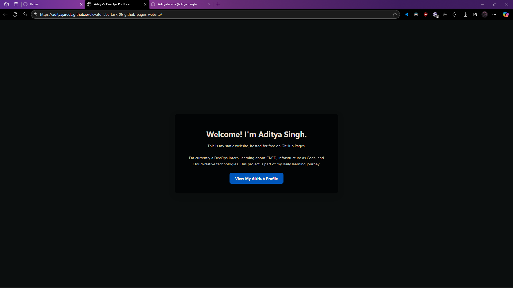

# Day 6: Static Website with GitHub Pages

This project is a simple, modern-looking static portfolio page built with HTML and CSS, and hosted for free using GitHub Pages.

## Live Website Link

**You can view the live, deployed website here:**

➡️ **https://adityajareda.github.io/elevate-labs-task-06-github-pages-website/**

## Objective

The goal of this task was to learn how to deploy static web content easily and for free. GitHub Pages is a fantastic tool for hosting personal portfolios, project documentation, or any other content that doesn't require a backend server.

## Technologies Used

*   **HTML5:** For the structure and content of the webpage.
*   **CSS3:** For styling, layout, and making the page responsive and visually appealing.
*   **GitHub Pages:** For the automated deployment and hosting of the static files.

## Deployment Process

1.  The `index.html` and `style.css` files were created and pushed to this GitHub repository.
2.  In the repository settings, under the "Pages" tab, the `main` branch was selected as the deployment source.
3.  GitHub Pages automatically detected the files, built the site, and deployed it to the public URL.

## Website Screenshot

Here is a screenshot of the final, deployed website:

****
